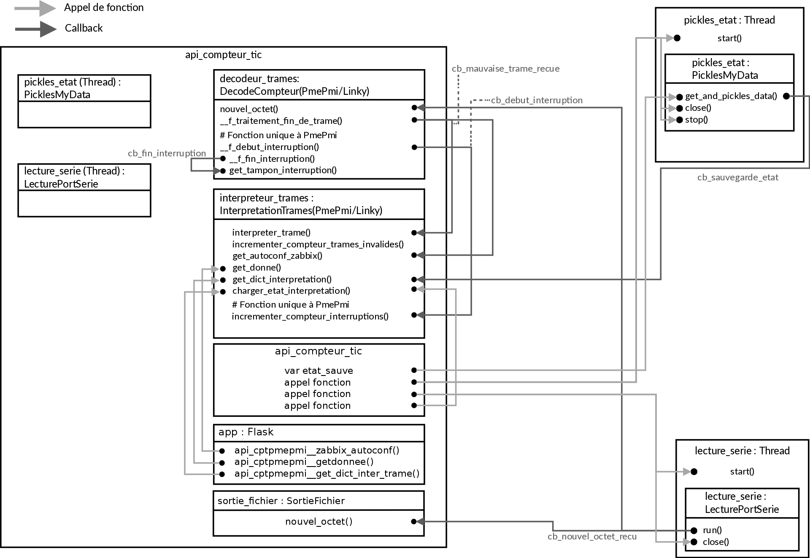

# Documentation Linky
[Résultat de recherche documentation télé-information client](https://www.enedis.fr/recherche?page=0%2C0%2C0%2C0&keywords=t%C3%A9l%C3%A9-information&types%5Bnews%5D=0&types%5Bpage%5D=0&types%5Bdocument%5D=0&types%5Bvideo%5D=0&index=documents)

Numero doc compteur :
   - Pmepmi : Enedis-NOI-CPT_02E
   - Linky  : Enedis-NOI-CPT_54E

# Diagramme modélisation des Threads et appel de fonction
Le diagramme est édité avec le logiciel libre [DIA](http://dia-installer.de/).

Ce diagramme représente les Threads avec et le ou les objets qu'ils comportent après instanciation. Les flèches en gris clairs sont des appels de fonctions, qui lancent des traitements ou affectent des variables. Les flèches en gris foncés sont des rappels de fonctions (callback). Quand un callback est affecté, il est possible d'appeler la fonction d'une autre classe (avec des paramètres s'il y a) indépendamment du Thread.
Exemple : Le Thread contenant l'objet de **lecture série** à un callback qui est appelé a chaque nouvel octet reçu. Ce callback est paramétré pour appeler la fonction **nouvel_octet()** de l'objet **decodeur_trames**.

# Fonctionnement du logiciel
## Introduction :
Ce programme permet le décodage des trames de Télé Information Client (TIC) de compteurs électrique ENEDIS.

Il y a trois threads :
- Le main ou sont instanciés les objets nécessaire au traitement, à la configuration de l'API et à la sortie fichier de la trame brut. Instancie flask et passe la main à flask.
- Le pickler, à intervalle régulier retourne une structure de données dans un fichier de sauvegarde. Il permet aussi de recharger les données au redémarrage du programme.
- La lecture série récupère les trames en sortie du compteur et appel à traiter chaque nouvel octet envoyé par le compteur.

## Algorithme :

Le décodage c'est le passage des octets reçus dans la machine à état qui ensuite créé des groupes de caractères (ensemble des octets entre un LF et un CR) et accumule ces groupes dans une variable (tant qu'il n'y a pas de caractère de fin de trame). On gère aussi les erreurs, que peut fournir la TIC. Chaque nouvel trame est ensuite interprétée.
Tandis que l'interprétation, prend chaque trame reçue qu'elle soit valide ou non pour les analyser et retourner une structure de données. L'analyse des trames fournit le nom du champ qu'on utilise pour valider l'existance du champ, la valeur du champ, parfois l'horodatage. D'autres données sont spécifiés grâce au documentation des compteurs (unité de valeur).

Les paquets  et classes sont chargés en fonctions de la configuration (Pmepmi ou Linky). Après instanciation des objets et des threads, c'est la lecture du lien série qui initie le traitement. Chaque nouvel octet reçu de la lecture série est envoyer par fonction de rappel à nouvel_octet(). D'abord les octets sont décodés (DecodeTrame), grâce à une machine à état. Elle gère les trames émises par le compteur. Chaque trame est composé de plusieurs groupes de caractères. L'octet passe dans la machine à état et, en fonction de sa valeur et de l'état en cours on exécute des fonctions. S'il y a un caractère spécial, il y a changement d'état (voir automate_a_etats.odg).

Une fois la trame complète et validé elle est envoyé a l'interpréteur qui créé une structure de données exploitable. A partir des documentations des compteurs, on a créé un dictionnaire répertoriant les caractéristiques des champs possibles dans une trame. Les informations auxquelles on a accès sont le type de valeur (numérique ou non), l'unité ou des valeurs qui permettent le traitement de manière déterministe... Le dictionnaire est exploité pour déterminer si les champs contenus dans les trames existent, dans le cas contraire on génère une erreur.

Enfin on peut accéder aux données en format JSON via l'API créée par Flask. Au fur et à mesure que les trames sont interprétées, on les fournit a Flask. Les interprétations sont aussi stockées dans un fichier local.

# API COMPTEUR TIC
Fichier :
    - decode_pmepmi.py
    - decode_linky.py
    - pickler.py
    - affichage.py
    - api_compteur_tic.py
    - api_compteur_tic.conf
    - pid.py

Thread :
    - main (api_compteur_tic.py)
    - PicklesMyData (pickler.py)
    - LecturePortSerie (decode_pmepmi.py)

## api_compteur_tic.py
    Description :
    Programme principal, initialisation des objets et threads.
    Création de l'API.

## api_compteur_tic.conf
    Description :
    Fichier de configuration de l'api des compteurs TIC, traitant les trames des compteurs TIC ENEDIS, LINKY et PMEPMI.
    Paramétrage du port série et de l'application.

## decode_pmepmi.py
    Description :
    Classe pour décoder la TIC des compteurs PME-PMI ENEDIS

    Class :
    LecturePortSerie            : Classe de lecture sur port serie
    LectureFichier              : Classe de lecture d'un fichier
    DecodeCompteurPmePmi        : Classe de decodage des trames des compteurs ENEDIS type PME-PMI
    InterpretationTramesPmePmi  : Classe d'interpretation des trames des compteurs ENEDIS type PME-PMI
    SortieFichier               : Classe de sortie fichier

## decode_linky.py
    Description :
    Classe pour décoder la TIC des compteurs LINKY ENEDIS

    Class :
    LecturePortSerie            : Classe de lecture sur port serie
    LectureFichier              : Classe de lecture d'un fichier
    DecodeCompteurLinky         : Classe de decodage des trames des compteurs ENEDIS type LINKY
    InterpretationTramesLinky   : Classe d'interpretation des trames des compteurs ENEDIS type LINKY
    SortieFichier               : Classe de sortie fichier

## pickler.py
    Description :
    Paquet de sauvegarde des données, à intervalle régulier.

    Class :
    PicklesMyData   : Data structure cyclic backup to file class

## affichage.py
    Description :
    Contient les classes d'affichage des trames et interpretations de trames
    Aide au développement, visualisation des trames.

    Class :
    AfficheTrames               : Classe d'affichage des trames avec un curseur sur le no de trame
    AfficheInterpretations      : Classe d'affichage des interpretations avec un curseur sur le no d'interpretation

## pid.py
    Description :
    Paquet de gestion de démon et fichier PID
